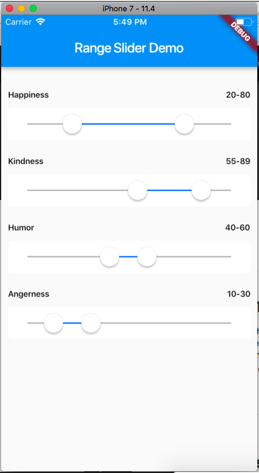
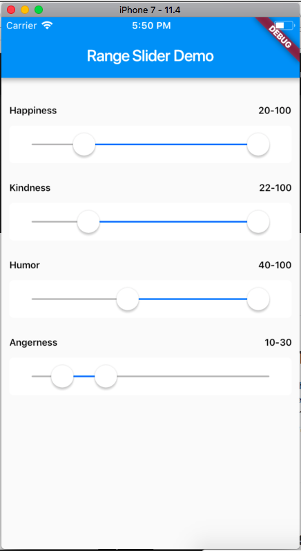

# Cupertino Range Slider
Widget is a slider that help you to choose a range from a set of values.




# Usage
Let's demo the basic usage
```dart
CupertinoRangeSlider(
        minValue: minValue, // Current min value
        maxValue: maxValue, // Current max value
        min: 1.0, // Min range value
        max: 100.0, // Max range value
        onMinChanged: (minVal){
        },
        onMaxChanged: (maxVal){
        },
)
```